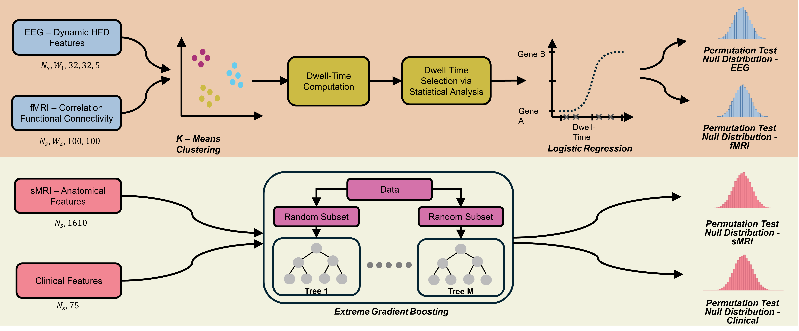
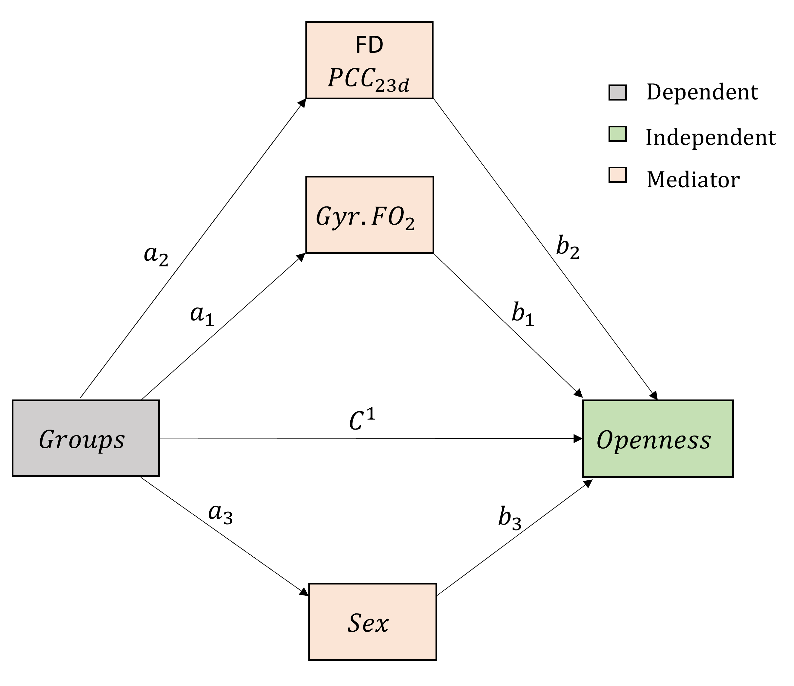

# MM-Mediation-Genes-AD

**An Exploration of Multimodal Neuroimaging, Clinical, and Mediation Analyses Reveals Distinct and Interactive Associations of APOE-ε4 and PICALM rs3851179 in Healthy Middle-Aged Adults: A Cohort Study**

## 🧠 Multimodal Analyses Performed

This project includes two major analytical components:

1. **Multimodal permutation testing** across EEG, fMRI, sMRI, and psychometric features.  
2. **Mediation analysis** examining indirect pathways between genotype, neuroimaging biomarkers, and psychological traits.

### 📊 Multimodal Permutation Testing Overview
<p align="center">
  
</p>

### 🔗 Mediation Model Used in the Study
<p align="center">
  
</p>

This repository contains the complete analysis pipeline used in the multimodal neuroimaging and mediation study. The structure keeps EEG preprocessing, feature extraction, permutation testing, and mediation workflows cleanly modular.

---

## 📁 Repository Structure

```plaintext
MM-Mediation-Genes-AD/
│
├── data/
│   └── ...                
│       # first 10 subject data is included, rest is available on https://openneuro.org/datasets/ds004796/versions/1.0.0
├── figures/
│   └── ...
│       # Figures for the README and manuscript
│
├── src/
│   ├── EEG_feature_analysis.ipynb
│   │   # Exploratory analysis of EEG feature sets
│   │
│   ├── EEG_feature_extraction.py
│   │   # Feature extraction (PSD, HFD, connectivity, microstates, etc.)
│   │
│   ├── eeg_permutation_hfd.py
│   │   # Permutation testing for HFD-related analyses
│   │
│   ├── EEG_raw_preprocessing.py
│   │   # Full EEG preprocessing pipeline: filtering, ICA, artifact removal, segmentation
│   │
│   ├── final_permutation_test.ipynb
│   │   # Final aggregated permutation testing and statistical summaries
│   │
│   ├── Mediation_Analysis.jasp
│   │   # JASP file with mediation models, effects, confidence intervals, bootstraps
│   │
│   ├── utils.py
│       # Shared helper functions and utility methods
│
└── README.md
    # Project overview (this file)
```

## Citation
Will be provided upon acceptance of the manuscript.
